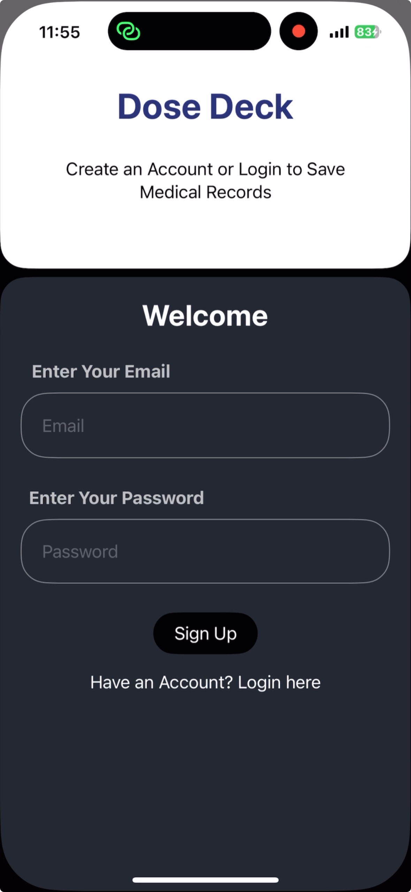
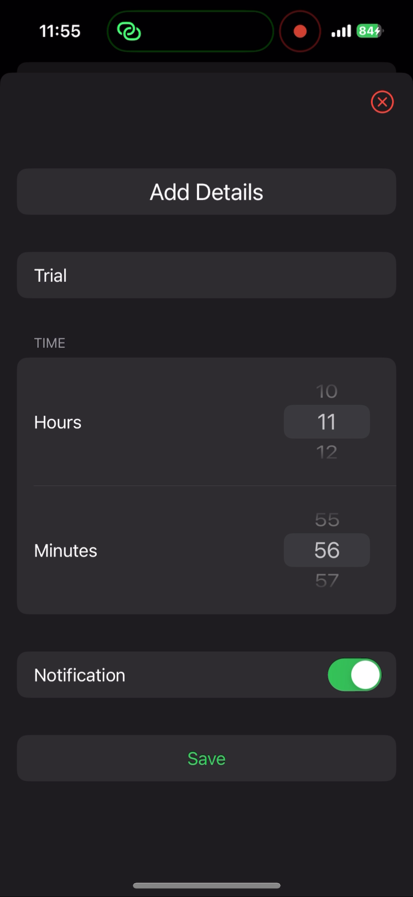

# Dose Deck

A medical record app for iOS that lets user to save medicine and time to take the medicine. It also sends a notification as per the user's medical timing.

## Tech Stack

- Swift
- Firebase

## Screenshots

 

 

## 🔗 Links

 
